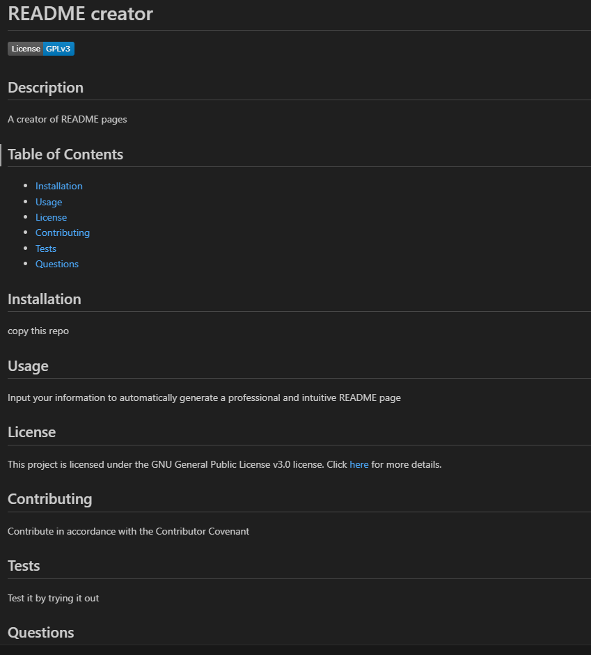

# README creator

## Description
This program uses the node extension inquirer to take user input and use it to create a README file. It automatically formats the page in markdown so the user does not have to remember where to put hashtags! Every project needs a README so anything to make it easy to generate is a benefit to society. 

## Usage
Input your information to automatically generate a professional and intuitive README page. It automatically generates a table of contents for simple navigation. You have three choices of license, whichever you choose will appear as a badge at the top of the page. When you add your contact info, it formats as a clickable link for ease of use. 

 

## Credits

edX bootcamp learning materials
https://www.npmjs.com/package/inquirer
edX Xpert learning assistant

## License
This project is licensed under the MIT License linked in this repo 

## Questions
For additional information, contact me using the following links:
GitHub: [melivesel](https://github.com/melivesel)
Email: melivesel@gmail.com